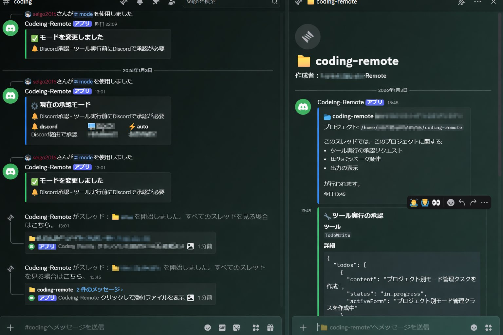
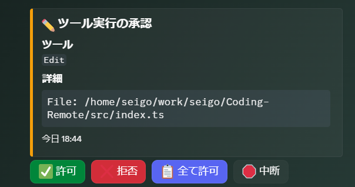
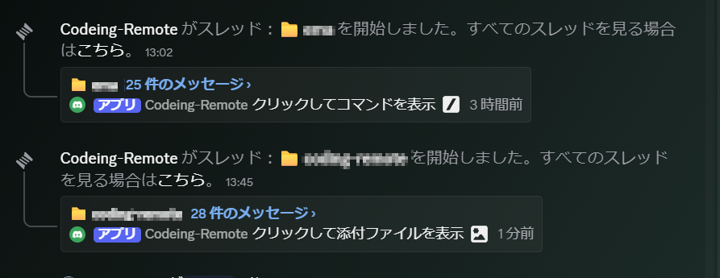
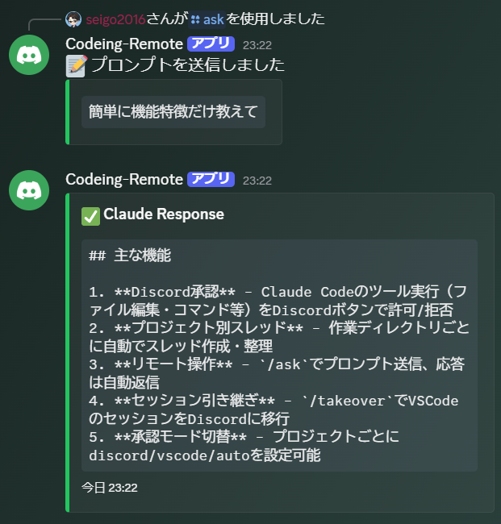

# Claude Code Remote - Discord Bot for Remote Claude Code Control

[](https://www.typescriptlang.org/)
[](https://nodejs.org/)
[](https://discord.js.org/)

Claude CodeのHooksと連携し、**ツール実行の承認をDiscord経由で行う**Bot。
離席時もDiscordからCLIセッションの操作が可能になり、モバイルからでもコーディングセッションを継続できます。



## 主な機能

### 1. Discord経由のツール承認

Claude Codeがファイル編集やコマンド実行を行う前に、Discordで承認/拒否できます。



| ボタン | 動作 |
|--------|------|
| ✅ 許可 | このツール実行を許可 |
| ❌ 拒否 | このツール実行を拒否 |
| 📋 全て許可 | 以降のツール実行を全て許可 |
| 🛑 中断 | セッションを中断 |

### 2. プロジェクト別スレッド管理

作業ディレクトリごとにDiscordスレッドを自動作成。プロジェクトが多くても通知が整理されます。



- `📁 プロジェクト名` 形式でスレッドを自動作成
- 既存スレッドは再利用（アーカイブ済みでも自動復元）
- スレッド内でコマンドを実行するとそのプロジェクトに紐づく

### 3. Discordからのリモートコーディング

`/ask` コマンドでプロンプトを送信し、Claudeの応答を**自動的にスレッドに送信**。VSCodeを開いていなくても、モバイルからコーディングを進められます。

```
/ask "このファイルのバグを修正して"
→ Claudeが作業
→ 応答が自動的にスレッドに送信される
```



### 4. セッション引き継ぎ（/takeover）

VSCodeで作業中のセッションをDiscordから引き継げます。PCの前を離れる時に便利。

```
/takeover <session_id>
```

VSCode側のClaudeプロセスを終了し、Discordから同じセッションを継続します。

### 5. 承認モード設定

プロジェクトごとに異なる承認モードを設定可能。信頼できるプロジェクトは自動承認にすることも。

| モード | 説明 |
|--------|------|
| `discord` | Discord経由で承認（デフォルト） |
| `vscode` | VSCodeのネイティブダイアログで承認 |
| `auto` | 全ツールを自動承認（注意して使用） |

```
/mode auto      # スレッド内で実行するとそのプロジェクトのみ auto に
/mode clear     # プロジェクト別設定を削除
```

**優先順位**: プロジェクト別設定 > グローバル設定 > デフォルト(discord)

---

## アーキテクチャ

```
┌─────────────────────────────────────────────────────────────┐
│           VSCode + Claude Code拡張（普段通り使用）           │
│                          │                                  │
│                          ↓ PreToolUse Hook                  │
│              ┌───────────────────────────┐                  │
│              │  hooks/pre-tool-use.cjs   │                  │
│              │  → HTTP API に承認要求     │                  │
│              └───────────────────────────┘                  │
└─────────────────────────────────────────────────────────────┘
                           ↓
┌─────────────────────────────────────────────────────────────┐
│         Approval Bot（バックグラウンド常駐）                  │
│  ┌─────────────────────────────────────────────────────┐    │
│  │  HTTP API Server ←→ Discord Bot ←→ Session Manager │    │
│  │  (localhost:3456)     (discord.js)  (Stream-JSON)  │    │
│  └─────────────────────────────────────────────────────┘    │
└─────────────────────────────────────────────────────────────┘
                           ↓
┌─────────────────────────────────────────────────────────────┐
│                        Discord                               │
│  ┌─────────────┐  ┌─────────────┐  ┌─────────────────────┐  │
│  │ 承認ボタン   │  │ /コマンド   │  │ 自動応答スレッド     │  │
│  └─────────────┘  └─────────────┘  └─────────────────────┘  │
└─────────────────────────────────────────────────────────────┘
```

### Stream-JSON モード

Discord経由で `/ask` を使う場合、内部では Claude CLI を `--print --input-format stream-json --output-format stream-json` モードで起動しています。これにより:

- プロンプトをJSON形式で送信
- 応答をリアルタイムで受信・パース
- セッション履歴は `.jsonl` ファイルで共有（VSCodeと同じセッションを継続可能）

---

## Discordコマンド一覧

| コマンド | 説明 |
|---------|------|
| `/sessions` | 利用可能なセッション一覧を表示 |
| `/continue [session_id]` | セッションを初期化（省略時は最新） |
| `/takeover <session_id>` | VSCode等からセッションを引き継ぐ（既存プロセスを終了） |
| `/ask` | プロンプトを送信（モーダル入力、応答は自動送信） |
| `/output [lines]` | 最新の出力を表示（デフォルト50行） |
| `/stop` | セッションを停止 |
| `/status` | セッション状態を表示 |
| `/mode [mode]` | 承認モードを変更/確認（スレッド内ではプロジェクト別） |
| `/mode clear` | プロジェクト別設定を削除（スレッド内のみ） |

### 典型的なワークフロー

#### デスクトップ作業時
```
1. VSCode + Claude Code拡張を普段通り使用
2. ツール実行時にDiscordの対応プロジェクトスレッドに承認リクエストが届く
3. デスクトップでもDiscordでも承認可能
4. 複数プロジェクトを同時に作業していても、スレッドで整理される
```

#### 離席時（モバイルから）
```
1. /sessions                    # セッション一覧を確認
2. /takeover abc123             # VSCodeから引き継ぎ
3. /ask "READMEを更新して"       # プロンプトを送信
   → 自動で応答がスレッドに送信される
4. （承認リクエストが来たらボタンで承認）
5. /ask "次の機能を実装して"     # 続けてプロンプト送信
6. /stop                        # 作業終了
```

---

## セットアップ

### 必要なもの

- Node.js 24 以上
- Discord Bot トークン（[Discord Developer Portal](https://discord.com/developers/applications)で作成）
- Discord サーバーの管理権限
- Claude Code CLI がインストール済み

### 1. インストール

```bash
git clone https://github.com/seigo2016/Coding-Remote.git
cd Coding-Remote
pnpm install
```

### 2. Discord Bot作成

1. [Discord Developer Portal](https://discord.com/developers/applications) にアクセス
2. "New Application" をクリック
3. Bot設定:
   - Bot → "Add Bot"
   - "MESSAGE CONTENT INTENT" を有効化
   - "Reset Token" でトークンを取得
4. OAuth2設定:
   - OAuth2 → URL Generator
   - Scopes: `bot`, `applications.commands`
   - Bot Permissions: `Send Messages`, `Create Public Threads`, `Send Messages in Threads`, `Embed Links`
5. 生成されたURLでBotをサーバーに招待

### 3. 環境変数設定

```bash
cp .env.example .env
```

`.env` を編集:

```env
DISCORD_BOT_TOKEN=your_bot_token_here
DISCORD_OWNER_ID=your_discord_user_id
DISCORD_CHANNEL_ID=notification_channel_id
```

### 4. Bot起動

```bash
pnpm build
pnpm start

# または開発モード
pnpm dev
```

### 5. Claude Code Hooks設定

`~/.claude/settings.json` に追加:

```json
{
  "hooks": {
    "PreToolUse": [
      {
        "matcher": "*",
        "hooks": [
          {
            "type": "command",
            "command": "node /path/to/Coding-Remote/hooks/pre-tool-use.cjs",
            "timeout": 300
          }
        ]
      }
    ]
  }
}
```

> **重要**: `timeout: 300` (5分) を設定することで、Discord承認を待つ時間を確保できます。

---

## 環境変数一覧

| 変数 | 説明 | デフォルト |
|------|------|-----------|
| `DISCORD_BOT_TOKEN` | Discord Bot トークン | (必須) |
| `DISCORD_OWNER_ID` | 操作を許可するユーザーID | (必須) |
| `DISCORD_CHANNEL_ID` | 通知先チャンネルID | (必須) |
| `API_PORT` | APIサーバーポート | 3456 |
| `API_HOST` | APIサーバーホスト | 127.0.0.1 |
| `APPROVAL_TIMEOUT_MS` | 承認タイムアウト (ms) | 300000 |
| `APPROVAL_DEFAULT_ACTION` | タイムアウト時の動作 | approve |
| `CLAUDE_WORKING_DIR` | CLIセッションの作業ディレクトリ | (カレントディレクトリ) |
| `LOG_LEVEL` | ログレベル | info |

---

## プロジェクト構造

```
src/
├── index.ts              # エントリーポイント
├── config/
│   └── index.ts          # 設定管理 (zod)
├── api/
│   ├── server.ts         # HTTP APIサーバー
│   └── types.ts
├── discord/
│   ├── client.ts         # Discord Bot（承認UI + コマンド）
│   ├── thread-manager.ts # プロジェクト別スレッド管理
│   └── types.ts
├── pty/
│   ├── manager.ts        # セッション管理 (Stream-JSON)
│   └── types.ts
└── utils/
    ├── logger.ts         # pino logger
    ├── mode.ts           # グローバル承認モード管理
    ├── project-mode.ts   # プロジェクト別承認モード管理
    └── error.ts          # カスタムエラー

hooks/
└── pre-tool-use.cjs      # Claude Code Hook スクリプト

docs/
└── pty-input-investigation.md  # 技術調査ドキュメント
```

---

## 開発

```bash
pnpm install        # 依存関係インストール
pnpm dev            # 開発モード (tsx watch)
pnpm build          # ビルド
pnpm start          # 本番起動
pnpm typecheck      # 型チェック
pnpm lint           # Lint
pnpm test           # テスト
```

---

## 技術スタック

- **TypeScript 5.x** - 型安全な開発
- **Node.js 24 LTS** - ランタイム
- **discord.js v14** - Discord Bot フレームワーク
- **pino** - 高速ロギング
- **zod** - スキーマバリデーション
- **vitest** - テストフレームワーク
- **tsup** - バンドラー

---

## トラブルシューティング

### 承認リクエストが届かない

1. Botが起動しているか確認: `pnpm start` のログを確認
2. Hookが設定されているか確認: `~/.claude/settings.json` を確認
3. APIが到達可能か確認: `curl http://localhost:3456/health`

### セッションが見つからない

- Claude Codeでセッションを開始した後に `/sessions` を実行してください
- セッションファイルは `~/.claude/projects/` 以下に保存されます

### /ask の応答が来ない

1. `/continue` または `/takeover` でセッションを初期化してから `/ask` を実行してください
2. ログで `Claude response completed` が出力されているか確認
3. `--resume` に必要なセッションIDが設定されているか確認

### VSCodeとの連携がうまくいかない

- VSCode側のClaudeセッションと同じセッションIDを使用してください
- `/takeover` でVSCode側のプロセスを終了してから作業してください

---

## ライセンス

MIT License

---

## 関連リンク

- [Claude Code 公式ドキュメント](https://docs.anthropic.com/claude-code)
- [discord.js ガイド](https://discordjs.guide/)
